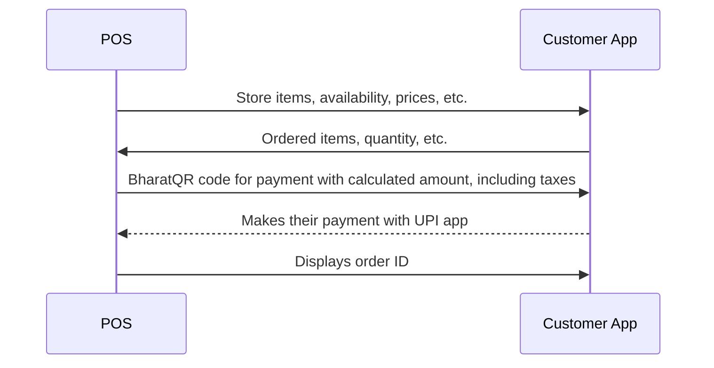
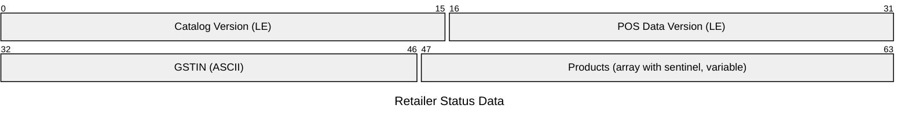

# POS Data Specification

*Revision 1*

The customer interacts with the merchant's POS to initiate the order. The POS
adopts a stateless protocol of data transfer, where the status of the stock
available in the customer is reported. The customer is equipped with a mobile
application which is used to scan a standardized barcode.

Any POS implementing the specification for a certain version must also consider
implementing the previous version as well, aiming backward compatibility.

This document focuses on the first two data transactions in the above diagram.

## Retailer Status

The retailer status is what the customer app should receive when a shopping
session is initiated. This includes the following data:

### Catalog Version

The catalog version which is installed in the merchant's inventory server.
*(2 bytes, unsigned non-zero integer)*

### POS Data Version

The version of this specification as displayed and expected by the POS
terminal. *(2 bytes, unsigned non-zero integer)*

### GSTIN

The GSTIN uniquely identifies a retailer. This data can be further used to pull
up information such as retailer name and address. The application may store it
in order history for the user. *(15 ASCII characters)*

### Products

The list of all products in the retail shop. *(array with sentinel)*  

#### Header

The product header contains data about the length of the other fields.
*(1 byte)*

- **Bits 0 through 3** specify the length of the UUID of the item.
The length is retrieved by the value in the bits, plus one.

- **Bits 4 and 5** specify the length of the available stock of the item.
The length is retrieved by the value in the bits, plus one.

- **Bits 6 and 7** specify the length of the selling price of the item.
The length is retrieved by the value in the bits, plus one.

#### UUID

The UUID uniquely identifies the product. This is defined in the [global
catalog](./global-catalog.md), this is a common dataset which is shared by all
applications. *(1 to 16 bytes, variable)*

The UUID is 16-bytes large. To reduce the size, the specification only mentions
enough bytes from the end which can uniquely identify the UUID. There's more
nuances on this as collisions may happen due to mismatch between catalog
versions. <!-- TODO document collision resolution -->

#### Available Stock

The available stock of the item. Zero should not be reported as then the entry
would simply be wastage of space. *(1 to 4 bytes, variable)*

#### Selling Price

The selling price is determined by the merchant. This is separate from the
`mrp` field defined in the [global catalog](./global-catalog.md). If `mrp` is
non-zero, then the selling price should be strictly less than or equal to
`mrp`. *(1 to 4 bytes, variable)*
